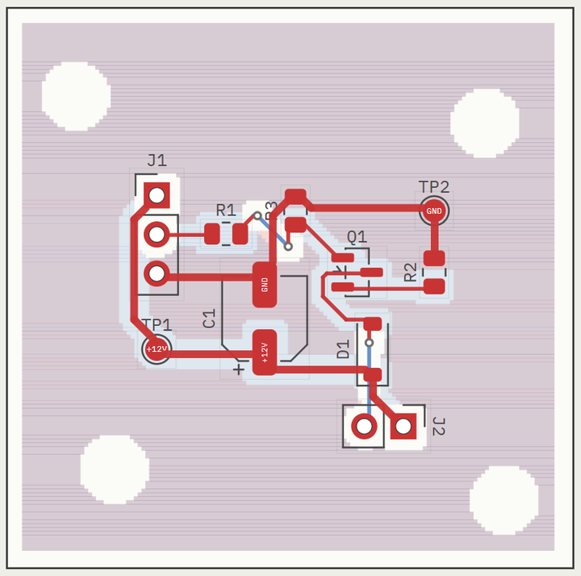

# SchemaForge

회로를 말로 설명하면 넷리스트·회로도·2층 PCB를 만들고, KiCad 설계 규칙 검사(DRC)까지 돌려서 `.net`, `.kicad_pcb`, 거버 파일로 내보내는 웹 앱.



위 이미지는 편집하지 않은 실제 출력이다. 저장소에 들어 있는 모터 드라이버 데모 회로(`server/test_circuits/nmos_motor.py`)를 돌린 결과로, 기판 36.7 × 36.4 mm, 배선 14/14 완료, 비아 3개, 트랙 길이 72 mm, KiCad DRC 오류 0이다. OpenAI 키 없이 `/?demo=motor`에서 같은 결과를 만들 수 있다.

## 무엇을 하나

| 단계 | 하는 일 | 쓰는 것 |
|---|---|---|
| 회로 | 설명에서 부품과 연결을 정하고 skidl 코드를 실행해 넷리스트를 만든다 | GPT-4o, skidl |
| 배치 | 부품마다 KiCad 풋프린트를 붙이고, 연결된 부품이 가까워지도록 자리를 잡는다 | 힘 기반 배치 (`server/pcb/placer.py`) |
| 배선 | 두 층에 트랙을 긋고, 막히면 비아로 층을 바꾼다. 전원 넷은 굵게 긋는다 | A* 경로 탐색 (`server/pcb/router.py`) |
| 마감 | GND 동박(pour), 고정 구멍 4개, 전원 넷 테스트 포인트를 넣는다 | `server/pcb/board.py` |
| 검사 | KiCad DRC와 회로 점검(전원 누락, 연결 안 된 핀)을 돌린다 | `kicad-cli`, `server/pcb/erc.py` |
| 다듬기 | 선택 사항. 모델이 배치·선 굵기 수정을 제안하고, **검사 수치가 좋아질 때만** 반영한다 | `server/ai_layout.ts` |

화면에서는 배치와 배선 과정을 그대로 재생하고, 완성된 기판은 2D(KiCad 색)와 3D(KiCad가 내보낸 GLB 모델)로 나란히 본다.

### AI 다듬기가 동작하는 방식

모델은 **제안만** 하고, 적용과 판정은 코드가 한다.

1. 기판 상태(부품 위치, 넷별 굵기, 지표, DRC 위반)를 모델에게 준다.
2. 모델이 이동·회전·선 굵기 변경을 제안한다.
3. 제안을 **선 폭 묶음 → 배치 묶음**으로 나눠, 묶음마다 따로 적용한다.
4. 묶음마다 겹침 사전 검사 → 재배선 → DRC → 점수 비교.
5. **나빠지거나 그대로면 되돌린다.** 좋아진 묶음만 남는다.

점수 순서: DRC 오류 → 미배선 → 겹침·기판 밖 → 디커플링 커패시터 거리 → 좁은 전원선 개수 → 선 길이 → 비아 → 트랙 길이.

## 필요한 것

- Node.js, Python (개발·검사 환경: Node 24.14, Python 3.14)
- **KiCad** — DRC, 거버, 3D 모델 내보내기에 `kicad-cli`가 필요하다 (확인한 버전 10.0.6). 없어도 기판 생성과 화면 표시는 되지만 검사·내보내기는 꺼진다 (`/health`가 어느 쪽인지 알려 준다)
- OpenAI API 키 — 회로 생성과 AI 다듬기에 쓴다. 없으면 내장 데모 회로 4개로만 돌린다

## 실행

```bash
npm install
pip install -r requirements.txt
cd server && npm install && cd ..
```

`server/.env`에 키를 넣는다 (`.env`는 커밋하지 않는다).

```
OPENAI_API_KEY=...
SUPABASE_URL=...            # 로그인·세션 저장 (없으면 메모리에만 저장)
SUPABASE_SERVICE_KEY=...
MOUSER_API_KEY=...          # 부품 검색 (선택)
KICAD_CLI_PATH=...          # kicad-cli가 PATH에 없을 때
```

```bash
npm run dev      # 화면(vite 3000) + API(8080) 동시 실행
```

`http://localhost:3000` 접속. 키 없이 보려면 `http://localhost:3000/?demo=motor` (다른 데모: `led`, `ne555`, `relay`).

### 그 밖의 환경 변수

| 변수 | 쓰임 |
|---|---|
| `PORT` | API 포트 (기본 8080) |
| `SF_AI_MODEL` | AI 다듬기에 쓸 모델 이름 |
| `SF_AI_JSON=1` | function calling 대신 JSON 응답으로 받기 (게이트웨이가 도구 호출을 지원하지 않을 때) |
| `SF_AI_STUB=1` | 모델 대신 고정된 제안을 쓰는 검사용 모드 |
| `OPENAI_BASE_URL` | OpenAI 호환 게이트웨이 주소 |

## 검사

```bash
python server/pcb/run_checks.py
```
테스트 회로 4개를 SMD·THT 두 방식으로, 즉 기판 8개를 만들어 각각 18항목을 확인한다 (풋프린트 매핑, 패드 좌표가 KiCad와 같은지, 극성, 코트야드 겹침, DRC, 거버, 배선 완료, 회로 점검 등). 여기에 더해 일부러 망가뜨린 회로(`broken_floating.py`)를 잡아내는지, 풋프린트 표가 맞는지도 확인한다.

```bash
cd server && npx tsx check_ai_layout.ts
```
AI 다듬기의 판정 규칙 13항목 (사전 검사, 점수 순서, 릴레이 접점·모터 경로의 부하 전류 넷 판정 등). 모델을 호출하지 않는다.

```bash
cd server && SF_AI_STUB=1 PORT=8098 npx tsx index.ts     # 다른 터미널에서
python server/pcb/check_ai_loop.py --port 8098
```
고정 배치 재현성과 다듬기 루프 6항목. 나쁜 제안이 되돌려지는지, 섞인 제안에서 좋은 쪽만 남는지 확인한다.

```bash
npx tsc --noEmit             # 화면 타입 검사
cd server && npm run typecheck
npm run lint
```

## 구조

```
src/                  화면 (React + TypeScript)
  components/
    FormComposer      홈: 설명 입력, 회로 종류 선택
    WizardPanel       생성 중 화면 (서버 단계·기록)
    ClarifyPanel      빠진 사양을 묻는 화면
    PlanPanel         설계 계획 확인 화면
    ResultPanel       결과 화면 틀 (좌우 패널·아래 탭)
    CircuitCanvas     회로도
    BoardView         기판 2D + 배치·배선 재생
    KiCad3DViewer     KiCad GLB 모델 3D 보기 (three.js)
server/
  index.ts            API, 스트리밍 생성, KiCad 호출
  ai_layout.ts        AI 다듬기: 제안 나누기·적용·점수
  pcb/
    board.py          기판 만들기 (배치 → 배선 → 동박 → 구멍 → 저장)
    placer.py         힘 기반 배치
    router.py         A* 배선
    erc.py            회로 점검
    footprints/       벤더 풋프린트 사본
  test_circuits/      검사·데모용 회로 5개
dev/board.html        기판 화면만 따로 띄우는 개발용 페이지
```

## 알려진 제약

- 2층 기판만 만든다. 기판 외형은 직사각형 고정.
- 부품 값(저항·커패시터 용량)의 타당성은 모델 판단에 의존한다. 제작 전에 직접 검토해야 한다.
- 배선은 격자 기반이라 트랙 각도가 제한된다.
- AI 다듬기는 한 번 돌 때마다 OpenAI 호출 비용이 든다. 기본은 꺼져 있다.

## 배포

Railway + Supabase 기준 순서는 [DEPLOY.md](DEPLOY.md) 참고. 컨테이너에 KiCad가 없으면 DRC·거버·3D가 비활성화된다.
